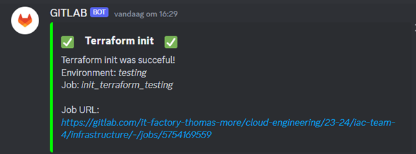

# AWS IaC challenge
Create a GitLab CI/CD pipeline that deploys a web application stack consisting of at least a web frontend AND a backend database component to AWS. Here we will show all the Terraform files with a little bit of extra explanation.

Infrastructure Repository (Terraform, RDS data)
- main branch (environment production)
- testing branch(environment testing)

Developer Repository (application, Dockerfile):
- main branch (environment production)
- testing branch (environment testing)
- link: https://gitlab.com/it-factory-thomas-more/cloud-engineering/23-24/iac-team-4/developer


## Table of Contents
[[_TOC_]]

## Diagram


The diagram shows two AWS (Amazon Web Services) regions, each consisting of a virtual private cloud (VPC) with different components and their interactions. A VPC is a logical network that isolates your AWS resources from the public internet and other AWS accounts. The diagram uses various AWS service icons to represent the cloud infrastructure, such as Elastic Load Balancers, EC2 instances,ECS FARGATE instance, NAT Gateways, and more.
## Branching strategy
### main
This branch contains has the production ready code, the environment coupled to this branch is the production environment.
### testing
This branch is used to test the new code, this way problems can be fixed before being pushed to production, this is also coupled to the testing environment.
### testing-jvdb
This branch is mainly used to test the pipeline independently of all other code, this is coupled to the testing environment.
### ls-testing-tf-2
This branch is used to independently test the terraform configurations that were made, this is also coupled to the testing environment.
## Application
The application being hosted is phpBB. More information about this application can be found via the link: https://www.phpbb.com/. 
```
FROM ubuntu:22.04

# Disable interactivity 
ENV DEBIAN_FRONTEND=noninteractive

# Install needed software
RUN apt-get update && \
    apt-get install -y \
    apache2 \
    php8.1 \
    php8.1-mbstring \
    php8.1-mysqli \
    php8.1-xml

# Copy local files to docker
COPY ./application/ /var/www/html/
COPY ./config.php /var/www/html/

# Change working directory
WORKDIR /var/www/html

# Change permissions of files
RUN chmod 666 config.php && \
    chmod 777 -R store/ cache/ files/ images/avatars/upload/

# Remove default index.html page
RUN rm index.html

# Open port 80
EXPOSE 80

# Start apache
CMD ["/usr/sbin/apachectl", "-D", "FOREGROUND"]
```
The Docker image is based on an Ubuntu server. Subsequently, an Apache web server is installed. Since the application is PHP-based, the necessary packages are then installed. Some packages require interaction, so the interactive prompts are disabled.

Afterward, the files from the repository are copied to the Docker container. The Docker container needs to communicate with the database, and the communication details are specified in the config.php file. This file is generated in the pipeline.

Certain directories also need to have the correct permissions to work with the application. Finally, the base index.html is removed, and the server is started.
## Terraform
This secrion of the documentation outlines the Terraform configuration that has been made to realize our solution.
### terraform.tf
This file specifies the required AWS provider and configures it for two different regions, 'us-east-1' and 'us-west-2'. An alias is assigned to the second provider to differentiate it from the default provider.

```
provider "aws" {
  alias      = "west"
  region     = "us-west-2"
}
```
Through the backend, the Terraform state file updates automatically, and is put into the Terraform states on GitLab. Because different state names are used, there is always a state file present for production and testing.

```
  backend "http" {
    # Specify your HTTP backend configuration if needed
  }
```


### VPC.tf
The VPC.tf file uses Terraform modules to create two VPCs, one for each region configured in the terraform.tf file. Each VPC is configured with public and private subnets, availability zones, and NAT gateways. This is an example of the east VPC created with a module.
```
module "vpc-east" {
  source = "terraform-aws-modules/vpc/aws"

  providers = {
    aws = aws
  }

  name = "vpc-east"
  cidr = "10.0.0.0/16"

  azs             = ["us-east-1a", "us-east-1b"]
  private_subnets = ["10.0.1.0/24", "10.0.2.0/24"]
  public_subnets  = ["10.0.3.0/24", "10.0.4.0/24"]

  enable_nat_gateway     = true
  one_nat_gateway_per_az = true
}

```
Inside this file VPC peering is also set up between the regions, this allows the VPCs to communicate with each other as if they were on the same network.

```
resource "aws_vpc_peering_connection" "peer" {
  vpc_id        = data.aws_vpc.vpc-east.id
  peer_vpc_id   = data.aws_vpc.vpc-west.id
  peer_owner_id = data.aws_caller_identity.current.account_id
  peer_region   = "us-west-2"
  auto_accept   = false

  depends_on = [module.vpc-east, module.vpc-west]
}

# Route for east vpc to west vpc
resource "aws_route" "route-east-to-west" {
  provider                  = aws
  route_table_id            = module.vpc-east.vpc_main_route_table_id
  destination_cidr_block    = module.vpc-west.vpc_cidr_block
  vpc_peering_connection_id = aws_vpc_peering_connection.peer.id

  depends_on = [module.vpc-east, module.vpc-west, aws_vpc_peering_connection.peer]
}
```

### security_groups.tf
Defines the AWS security groups, two for the ECS services and two for the loadbalancer. These groups control traffic between ECS services and load balancers in both the east and the west region. For each rule, there is an ingress and egress.
#### ECS:
```
resource "aws_security_group" "ecs_sg_east" {
  provider    = aws
  name        = "ecs_sg_east"
  description = "Allow inbound traffic from the load balancer to the ECS service in the east region"
  vpc_id      = module.vpc-east.vpc_id

  ingress {
    from_port       = 80
    to_port         = 80
    protocol        = "tcp"
    security_groups = [aws_security_group.lb_sg_east.id]
  }

  egress {
    from_port   = 0
    to_port     = 0
    protocol    = "-1"
    cidr_blocks = ["0.0.0.0/0"]
  }
}
```
#### Load balancer:
```
resource "aws_security_group" "lb_sg_east" {
  provider    = aws
  name        = "lb_sg_east"
  description = "Allow traffic from the Internet to the load balancer in the east region"
  vpc_id      = module.vpc-east.vpc_id

  ingress {
    from_port   = 80
    to_port     = 80
    protocol    = "tcp"
    cidr_blocks = ["0.0.0.0/0"]
  }

  egress {
    from_port   = 0
    to_port     = 0
    protocol    = "-1"
    cidr_blocks = ["0.0.0.0/0"]
  }
}
```
#### Instance:
With this security group we allow to setup the database
```
resource "aws_security_group" "instance_sg" {
  name        = "instance_sg"
  description = "Allow inbound traffic ssh and mysql"
  vpc_id      = module.vpc-east.vpc_id

  ingress {
    description = "MySQL from VPC"
    from_port   = 3306
    to_port     = 3306
    protocol    = "tcp"
    cidr_blocks = ["0.0.0.0/0"]

  }
  egress {
    description = "Allow all outbound traffic"
    from_port   = 0
    to_port     = 0
    protocol    = "-1"
    cidr_blocks = ["0.0.0.0/0"]
  }
}
```
#### RDS
```
resource "aws_security_group" "rds_sg" {
  name        = "rds_sg"
  description = "Allow inbound traffic from the VPC"
  vpc_id      = module.vpc-east.vpc_id

  ingress {
    description = "MySQL from VPC"
    from_port   = 3306
    to_port     = 3306
    protocol    = "tcp"
    cidr_blocks = ["0.0.0.0/0"]
  }

  egress {
    description = "Allow all outbound traffic"
    from_port   = 0
    to_port     = 0
    protocol    = "-1"
    cidr_blocks = ["0.0.0.0/0"]
  }
}
```
### load_balancer.tf
Defines the application load balancers, these are configured to distribute incoming HTTP traffic across ECS instances in both the east and the west region. One load balancer is created in the public subnet in both regions.
```
module "lb_east" {
  source  = "terraform-aws-modules/alb/aws"
  version = "~> 5.0"

  providers = {
    aws = aws
  }

  name               = "loadbalancing-east"
  load_balancer_type = "application"
  vpc_id             = module.vpc-east.vpc_id
  subnets            = module.vpc-east.public_subnets
  security_groups    = [aws_security_group.lb_sg_east.id]

  http_tcp_listeners = [
    {
      port                  = 80,
      protocol              = "HTTP",
      target_group_name     = "webserver-tg-east"
      target_group_port     = 80
      target_group_protocol = "HTTP"
    }
  ]

  target_groups = [
    {
      name             = "webserver-tg-east"
      backend_protocol = "HTTP"
      backend_port     = 80
      target_type      = "ip"
    }
  ]

}
```
### ECR.tf
This sets up an ECR repository named "ecr" used to store container images.
```
resource "aws_ecr_repository" "ecr" {
  name = "ecr"

  image_scanning_configuration {
    scan_on_push = true
  }

  tags = {
    Name = "ECR Repository"
  }
}
```
### ECS.tf
Creates a cluster for both regions. With a task definition, you can then spin up a service or task which is the container you are hosting. The service will be on a fargate serverless solution. It will be accessible using the loadbalancer.
```
resource "aws_ecs_service" "service-east" {
  provider        = aws
  name            = "service_east"
  cluster         = aws_ecs_cluster.ecs-east.id
  task_definition = aws_ecs_task_definition.service-east.arn
  desired_count   = 0 # Set to 0 to prevent the service from running until the load balancer/ECR image
  launch_type     = "FARGATE"

  network_configuration {
    subnets          = [module.vpc-east.private_subnets[0], module.vpc-east.private_subnets[1]]
    assign_public_ip = false
    security_groups  = [aws_security_group.ecs_sg_east.id, aws_security_group.ecs_instance_sg_east.id]
  }

  load_balancer {
    target_group_arn = module.lb_east.target_group_arns[0]
    container_name   = "service-east-container"
    container_port   = 80
  }

  depends_on = [
    module.lb_west,
    module.lb_east,
    aws_ecs_task_definition.service-east
  ]
}
```
This the task definition. The task definition will determine which image needs to be pulled and what type of instance is used.
```
resource "aws_ecs_task_definition" "service-east" {
  family                   = "service-east"
  task_role_arn            = data.aws_iam_role.LabRole.arn
  execution_role_arn       = data.aws_iam_role.LabRole.arn
  network_mode             = "awsvpc"
  cpu                      = "256"
  memory                   = "1024"
  requires_compatibilities = ["FARGATE"]
  container_definitions    = <<DEFINITION
  [
    {
      "name": "service-east-container",
      "image": "${aws_ecr_repository.ecr.repository_url}:latest",
      "cpu": 256,
      "memory": 1024,
      "essential": true,
      "portMappings": [
        {
          "containerPort": 80,
          "hostPort": 80
        }
      ]  
    }
  ]
  DEFINITION
}
```
### S3.tf
The S3.tf file sets up a S3 bucket and its replication configuration. The replication configuration ensures that objects stored in the bucket are replicated to the replica bucket. The replica gets created in the west region so that the data is stored in both regions.
```
replication_configuration = {
    role = data.aws_iam_role.LabRole.arn

    rules = [
      {
        id     = "replication"
        status = "Enabled"

        delete_marker_replication = false


        destination = {
          bucket        = module.s3_bucket_replica.s3_bucket_arn
          storage_class = "STANDARD"
        }
      },
    ]
  }
```
#### Bucket replica
```
module "s3_bucket_replica" {
  source = "terraform-aws-modules/s3-bucket/aws"
  providers = {
    aws = aws.west
  }

  bucket = var.s3_bucketname_replica

  versioning = {
    enabled = true
  }

}
```
In the created bucket two files get stored sql.zip and loop.sh, these files are used to fill the RDS with the needed data to run the application.
```
# Push sql.zip to the S3 bucket
resource "aws_s3_object" "object" {
  bucket     = module.s3_bucket.s3_bucket_id
  key        = "sql.zip"
  source     = "../data/sql.zip"
  depends_on = [module.s3_bucket]

}

# Push loop.sh to the S3 bucket
resource "aws_s3_object" "object2" {
  bucket     = module.s3_bucket.s3_bucket_id
  key        = "loop.sh"
  source     = "../scripts/loop.sh"
  depends_on = [module.s3_bucket]

}
```
### EC2.tf
This file ensures the deployment of the EC2 instances in the specified subnet, these are configured with a specific AMI, instance type, and security group. Thanks to the user data script necessary software can be installed, it also retrieves the script and file from the S3 bucket. After retrieving the necessary files, the loop.sh script runs and fills out the necessary data in the RDS.
```
resource "aws_instance" "instance" {
  count                       = var.ec2_count
  ami                         = data.aws_ami.ami.id
  instance_type               = "t2.micro"
  subnet_id                   = module.vpc-east.public_subnets[0]
  associate_public_ip_address = true

  security_groups = [aws_security_group.instance_sg.id]
  user_data       = <<-EOF
    #!/bin/bash
    sudo yum update -y
    sudo yum install mysql -y
    sudo yum install unzip -y

    export AWS_ACCESS_KEY_ID=${var.aws_access_key}
    export AWS_SECRET_ACCESS_KEY=${var.aws_secret_key}
    export AWS_SESSION_TOKEN=${var.aws_token}
    export AWS_DEFAULT_REGION="us-east-1"
    export AWS_DEFAULT_OUTPUT="json"

    aws s3 cp s3://${module.s3_bucket.s3_bucket_id}/loop.sh .
    aws s3 cp s3://${module.s3_bucket.s3_bucket_id}/sql.zip .

    sudo unzip sql.zip
    
    sudo chmod +x loop.sh
    sudo ./loop.sh ${var.rds_password} ${var.rds_username} ${aws_db_instance.db-east-1a.address}
    EOF

  depends_on = [module.vpc-east, module.s3_bucket]
}
```
### RDS.tf
RDS.tf defines a relational database service configured with MySQL 5.7 the DB subnet group ensures that the RDS instance is placed in the desired subnet. Through the previously set up EC2 and the loop.sh script, the necessary data can be placed inside the RDS.

```
resource "aws_db_subnet_group" "subnet_group_east" {
  name       = "main"
  subnet_ids = module.vpc-east.private_subnets

  tags = {
    Name = "My DB subnet group"
  }
}

# Creating a database instance in us-east
resource "aws_db_instance" "db-east-1a" {
  provider                = aws
  identifier              = "db-east-1a"
  allocated_storage       = 10
  max_allocated_storage   = 25
  db_name                 = "phpbb"
  engine                  = "mysql"
  engine_version          = "5.7"
  instance_class          = "db.t3.micro"
  username                = var.rds_username
  password                = var.rds_password
  parameter_group_name    = "default.mysql5.7"
  skip_final_snapshot     = true
  backup_retention_period = 7
  vpc_security_group_ids  = [aws_security_group.rds_sg_east.id]
  # aws_security_group.rds_sg.id
  db_subnet_group_name = aws_db_subnet_group.subnet_group_east.name

  publicly_accessible = false
  availability_zone   = "us-east-1a"

  tags = {
    Name = "db-east-1a"
  }
}

```


## CI/CD pipeline


As you can see in the image above, there are two pipelines. The first sets up the infrastructure on which an application with database can be hosted. This pipeline resides in the infrastructure repository. The second pipeline is that of the repository developers. Here, developers separate from the infrastructure can develop their application and build their docker container.

Before we dive deeper into the pipeline, here is some general information that is going to help you understand the pipeline better.

### Environments:
Two environments are used: Production and Testing. Through these environments, we can make the pipeline execute jobs with certain variables. Below is an example of how the CI variables are 
created.


The variables use the same name but are linked to
different environments so the pipeline will fetch the variable from the environment it is running in.
We chose to link the branch testing to the environment testing and the branch main to the environment production.

```yml
 ## START NOTIFICATION ###
 .start_notification:
   stage: start
   script:
     - start_notification

 start_notification_testing:
   extends: .start_notification
   environment:
     name: testing
   rules:
     - if: $CI_COMMIT_BRANCH == "testing"

 start_notification_production:
   extends: .start_notification
   environment:
     name: production
   rules:
     - if: $CI_COMMIT_BRANCH == "main"
```

In this job, you will see that a general job (.start_notification) is set up first. Then two jobs are created for each environment, this job extends the general job.  An environment is also linked to these jobs. Through rules, it is determined when a job should run.

### Default settings pipeline
```yml
 ### DEFAULT SETTINGS ###
 default:
   image:
     name: "$CI_TEMPLATE_REGISTRY_HOST/gitlab-org/terraform-images/stable:latest"
   cache:
     key: "${TF_ROOT}"
     paths:
       - ${TF_ROOT}/.terraform/
```

This defines the basic settings of the pipeline. When there is no image defined at job level, the image defined in default will be used. Next, a path is set up where it writes its modules when executing Terraform tasks.

### functions.sh
Both pipelines use a helper script this keeps the pipeline organized. The helper script is a bash script with functions that can be called in the pipeline.

At the top of the pipeline, the script is sourced via a before_script run, the path to the script is determined via a CI variable.

```yml
 before_script:
   - source $SCRIPT
```

After this we can call the functions as shown below.

```yml
   script:
     - start_notification
```

### needs
Inside the pipeline you will often come across similar pieces of code like shown below.

```yml
   needs: 
     - apply_terraform_testing
```

This ensures that a job will not start until the previous job is complete this is especially useful if there are multiple jobs in 1 stage that depend on each other.

### Pipeline infrastructure
#### Sast
Using an image (found in CI variables) created to perform sast scans, a sast scan is performed on the files in the repository. The results are then placed in an artifact so that they can be retrieved in other jobs. This job will only be run in the testing environment. Because normally, no faulty code gets into production.  The code is written so that a quick job can be written to run the sast scan on production as well.
Then a discord message will be sent with the level of the highest vulnerability and a link to the report, this report can be viewed when the pipeline is done running. 
The highest ***variable*** is extracted via a json query, and then a switch case determines how the message should be written. The function can be found via functions.sh → sast_notification

### Stage checks
#### Validate AWS credentials
This is where we validate the AWS credentials defined in the GitLab variables. Since two environments are used, there's also two different sets of AWS credentials that need validating.

This happens through a function in the helper script. The script will use an AWS CLI command to check for the credentials, first there is a check to see if there are credentials present. If this is not the case, a Discord message will be sent saying these are missing.

If credentials are present, the following command gets used to check their validity:
```
aws sts get-caller-identity
```
When credentials are present and valid, the command will return information about the AWS identity and access management the output of the command typically looks like this:
```
{
    "Account": "123456789012",
    "UserId": "ABCDEFGHIJKLMNOPQRSTU:example-user",
    "Arn": "arn:aws:iam::123456789012:user/example-user"
}
```
Based on this, it can be determined whether the given AWS credentials are still valid. Based on the output that was given by the get-caller-identity command, the appropriate Discord message gets sent.

```bash
check_credentials(){
    # Check -> Credentials empty -> Send notification accordingly 
    if [ -z "$AWS_ACCESS_KEY_ID" ] || [ -z "$AWS_SECRET_ACCESS_KEY" ] || [ -z "$AWS_DEFAULT_REGION" ]; then
        send_notification "⛔" "**AWS Credentials**" "AWS Credentials are missing. Please insert your credentials\n\nJob URL:\n*$CI_JOB_URL*" 16711680
        exit 1 # Stop the pipeline
    else
        # Setup a profile with the credentials
        aws configure set aws_access_key_id $AWS_ACCESS_KEY_ID
        aws configure set aws_secret_access_key $AWS_SECRET_ACCESS_KEY
        aws configure set default.region $AWS_DEFAULT_REGION
        
        # Check -> Credentials valid -> Send notification accordingly 
        if aws sts get-caller-identity; then
            send_notification "✅" "**AWS Credentials**" "AWS Credentials are valid.  \n\nJob URL:\n*$CI_JOB_URL*" 65280
        else
            send_notification "⛔" "**AWS Credentials**" "AWS Credentials are invalid. Please update your credentials!\n\nJob URL:\n*$CI_JOB_URL*" 16711680
            exit 1 # Stop the pipeline
        fi
    fi
}
```

#### Validate_terraform

This is where we validate the terraform configuration. By default, we utilize a GitLab image that has been created to execute Terraform actions. Therefore, we only require the gitlab-terrafrom command to execute these actions.

With the help of a function in the helper script, this will be done completely because init, plan and apply also work the same way, but the pipeline has to specify which action is involved. Then the function will also build an appropriate message that is then sent to discord.

```bash
# Terraform operations
terraform_operation() {
    # Local variable
    local action="$1"

    # Run Terraform operation -> Send notification accordingly 
    if gitlab-terraform "$action"; then
        terraform_notification "✅" "$action" "was succeful" 65280
    else
        terraform_notification "⛔" "$action" "has failed" 16711680
        exit 1
    fi
}
```

This is what the notifications look like in Discord.



If something goes wrong while performing this actions the pipeline will be stopped.

#### Stage Terraform
__init__:
Sets up a working directory where plugins are installed. The location of this directory was previously determined in the default settings.

__plan__: 
Then a terraform plan will be executed, the change will be captured in a json. This json can be queried from artifacts, thanks to this a And thus a state file will be created. This state file is also linked to an environment.

```yml
 #### PLAN TERRAFORM ###
 .plan_terraform:
   stage: terraform
   script: 
     - terraform_operation "plan"
   resource_group: ${TF_STATE_NAME}
   artifacts:
     public: false
     paths:
       - ${TF_ROOT}/plan.cache
     reports:
       terraform: ${TF_ROOT}/plan.json
```

Thanks to the line "public: false" the artifact will not become public.

__apply_terraform__:

Here, the terraform configuration is going to be applied to AWS. Because we have two environments, there will also be two AWS environments. Through the CI variables, it will select an AWS environment according to the environment.

```
- gitlab-terraform output -json > ./outputs.json
```

The output of the terraform files will be stored in json format in an artifact so that it can be used in the next job.

__update_variables__:

To make our setup as dynamic as possible and repeat the same action as little as possible. We write away the outputs created by terraform into CI variables.

In functions.sh you will find the following function update_variables.
```bash
### Update the CI variables ###
update_variables(){
    # update variables on Infrastructure reposistory
    # ECR
    curl --request PUT --header "PRIVATE-TOKEN: $ACCESS_TOKEN_INFRASTRUCTURE" "$REPOSITORY_URL_INFRASTRUCTURE/variables/OUTPUT_ECR_NAME" --form "value=$(jq -r .ecr_name.value outputs.json)"  --form "filter[environment_scope]=$CI_ENVIRONMENT_NAME" > /dev/null
    curl --request PUT --header "PRIVATE-TOKEN: $ACCESS_TOKEN_INFRASTRUCTURE" "$REPOSITORY_URL_INFRASTRUCTURE/variables/OUTPUT_ECR_URL" --form "value=$(jq -r .ecr_url.value outputs.json)"  --form "filter[environment_scope]=$CI_ENVIRONMENT_NAME" > /dev/null

    # ECS
    curl --request PUT --header "PRIVATE-TOKEN: $ACCESS_TOKEN_INFRASTRUCTURE" "$REPOSITORY_URL_INFRASTRUCTURE/variables/OUTPUT_ECS_NAME_EAST" --form "value=$(jq -r .ecs_name_east.value outputs.json)"  --form "filter[environment_scope]=$CI_ENVIRONMENT_NAME" > /dev/null
    curl --request PUT --header "PRIVATE-TOKEN: $ACCESS_TOKEN_INFRASTRUCTURE" "$REPOSITORY_URL_INFRASTRUCTURE/variables/OUTPUT_ECS_NAME_WEST" --form "value=$(jq -r .ecs_name_west.value outputs.json)"  --form "filter[environment_scope]=$CI_ENVIRONMENT_NAME" > /dev/null
    curl --request PUT --header "PRIVATE-TOKEN: $ACCESS_TOKEN_INFRASTRUCTURE" "$REPOSITORY_URL_INFRASTRUCTURE/variables/OUTPUT_ECS_SERVICE_NAME_EAST" --form "value=$(jq -r .ecs_service_name_east.value outputs.json)"  --form "filter[environment_scope]=$CI_ENVIRONMENT_NAME" > /dev/null
    curl --request PUT --header "PRIVATE-TOKEN: $ACCESS_TOKEN_INFRASTRUCTURE" "$REPOSITORY_URL_INFRASTRUCTURE/variables/OUTPUT_ECS_SERVICE_NAME_WEST" --form "value=$(jq -r .ecs_service_name_west.value outputs.json)"  --form "filter[environment_scope]=$CI_ENVIRONMENT_NAME" > /dev/null 

    # RDS
    curl --request PUT --header "PRIVATE-TOKEN: $ACCESS_TOKEN_INFRASTRUCTURE" "$REPOSITORY_URL_INFRASTRUCTURE/variables/OUTPUT_RDS_ID" --form "value=$(jq -r .rds_id.value outputs.json)"  --form "filter[environment_scope]=$CI_ENVIRONMENT_NAME" > /dev/null
    curl --request PUT --header "PRIVATE-TOKEN: $ACCESS_TOKEN_INFRASTRUCTURE" "$REPOSITORY_URL_INFRASTRUCTURE/variables/OUTPUT_RDS_NAME" --form "value=$(jq -r .rds_name.value outputs.json)" --form "filter[environment_scope]=$CI_ENVIRONMENT_NAME" > /dev/null
    curl --request PUT --header "PRIVATE-TOKEN: $ACCESS_TOKEN_INFRASTRUCTURE" "$REPOSITORY_URL_INFRASTRUCTURE/variables/OUTPUT_RDS_ENDPOINT" --form "value=$(jq -r .rds_endpoint.value outputs.json)"  --form "filter[environment_scope]=$CI_ENVIRONMENT_NAME" > /dev/null

    # ALB
    curl --request PUT --header "PRIVATE-TOKEN: $ACCESS_TOKEN_INFRASTRUCTURE" "$REPOSITORY_URL_INFRASTRUCTURE/variables/OUTPUT_ALB_DNS_NAME_EAST" --form "value=$(jq -r .alb_dns_name_east.value outputs.json)"  --form "filter[environment_scope]=$CI_ENVIRONMENT_NAME" > /dev/null
    curl --request PUT --header "PRIVATE-TOKEN: $ACCESS_TOKEN_INFRASTRUCTURE" "$REPOSITORY_URL_INFRASTRUCTURE/variables/OUTPUT_ALB_DNS_NAME_WEST" --form "value=$(jq -r .alb_dns_name_west.value outputs.json)"  --form "filter[environment_scope]=$CI_ENVIRONMENT_NAME" > /dev/null
    curl --request PUT --header "PRIVATE-TOKEN: $ACCESS_TOKEN_INFRASTRUCTURE" "$REPOSITORY_URL_INFRASTRUCTURE/variables/OUTPUT_ALB_ID_EAST" --form "value=$(jq -r .alb_arn_east.value outputs.json)"  --form "filter[environment_scope]=$CI_ENVIRONMENT_NAME" > /dev/null
    curl --request PUT --header "PRIVATE-TOKEN: $ACCESS_TOKEN_INFRASTRUCTURE" "$REPOSITORY_URL_INFRASTRUCTURE/variables/OUTPUT_ALB_ID_WEST" --form "value=$(jq -r .alb_arn_west.value outputs.json)"  --form "filter[environment_scope]=$CI_ENVIRONMENT_NAME" > /dev/null
    
    # update variables on Developer reposistory
    curl --request PUT --header "PRIVATE-TOKEN: $ACCESS_TOKEN_DEVELOPER" "$REPOSITORY_URL_DEVELOPER/variables/DB_HOST" --form "value=$(jq -r .rds_endpoint.value outputs.json)"  --form "filter[environment_scope]=$CI_ENVIRONMENT_NAME" > /dev/null
    curl --request PUT --header "PRIVATE-TOKEN: $ACCESS_TOKEN_DEVELOPER" "$REPOSITORY_URL_DEVELOPER/variables/DB_NAME" --form "value=$(jq -r .rds_name.value outputs.json)"  --form "filter[environment_scope]=$CI_ENVIRONMENT_NAME" > /dev/null 
    curl --request PUT --header "PRIVATE-TOKEN: $ACCESS_TOKEN_DEVELOPER" "$REPOSITORY_URL_DEVELOPER/variables/DB_PASSWD" --form "value=$TF_VAR_rds_password"  --form "filter[environment_scope]=$CI_ENVIRONMENT_NAME" > /dev/null
    curl --request PUT --header "PRIVATE-TOKEN: $ACCESS_TOKEN_DEVELOPER" "$REPOSITORY_URL_DEVELOPER/variables/DB_USER" --form "value=$TF_VAR_rds_username"  --form "filter[environment_scope]=$CI_ENVIRONMENT_NAME"  > /dev/null

    # Check if updates were successful
    if [ $? -eq 0 ]; then
        send_notification "✅" "**Update variables**" "Updated the CI variables to the latest values.\n\nJob URL:\n*$CI_JOB_URL*" 65280
    else
        send_notification "⛔" "**Update variables**" "Failed to update the CI variables to the latest values.\n\nJob URL:\n*$CI_JOB_URL*" 16711680   
    fi

}
```

Here you see several curl commands that are going to update the variables to new values
Some form of authentication is required to execute these curl commands.
```
    curl --request PUT --header "PRIVATE-TOKEN: $ACCESS_TOKEN_INFRASTRUCTURE"
```

For each repository, we created an access token that has the appropriate permissions to update the variable.

```
"filter[environment_scope]=$CI_ENVIRONMENT_NAME"
```

Because we are working with two environments and each variable is duplicated in our CI variables, we need to add the following filter so that the correct variable is updated.

```
/dev/null
```

The /dev/null option ensures that there is no output from the curl command. Otherwise, the new values would be displayed in plain text in the pipeline.

#### Stage docker
__docker_image__:

Since this job does not require terraform, another image is used. On this image, the necessary packages are installed to pull and push a docker file. 
A function called push_docker_image is created for this job.

```bash
# Push a docker image to the AWS registry (ECR)
push_docker_image(){
    # Login to the registry
    docker login -u $READ_REGISTRY_USERNAME -p $ACCESS_TOKEN_DEVELOPER $DEVELOPER_REGISTRY

    # Check -> Pull was succesfull
    if docker pull $DEVELOPER_REGISTRY:$IMAGE_TAG; then
        # Login to ECR
        aws ecr get-login-password --region $AWS_DEFAULT_REGION | docker login --username AWS --password-stdin $OUTPUT_ECR_URL

        # Tag and push to ECR
        docker tag $DEVELOPER_REGISTRY:$IMAGE_TAG $OUTPUT_ECR_URL:latest
        docker push $OUTPUT_ECR_URL:latest

        # Up the desired count so ECS start working
        # EAST 
        aws ecs update-service --cluster $OUTPUT_ECS_NAME_EAST --service $OUTPUT_ECS_SERVICE_NAME_EAST --desired-count 2

        # WEST
        aws ecs update-service --cluster $OUTPUT_ECS_NAME_WEST --service $OUTPUT_ECS_SERVICE_NAME_WEST --desired-count 2 --region us-west-2

        # Send notificationn
        send_notification "✅" "**Docker Image**" "The latest docker image is pushed to the AWS ECR!" 65280
    else
        # Trigger developer pipeline -> Build a docker image
        curl -X POST  -F token=$TRIGGER_TOKEN -F ref=$BRANCH_DEV $TRIGGER_URL > /dev/null

        # Send notificationn
        send_notification "☑️" "**Docker Image**" "No Dockerfile in the repository, but the developer pipeline's on it. Check back in 10 min for the results." 255
        exit 1 # Stop the pipeline
    fi
}
```

This function is going to log into the developer's repository docker registry, then it is going to try to pull the requested docker image. If that is successful, the docker image will be pushed to the ECR on Amazon. Since we are using an image that supports AWS CLI, the authentication will be smooth. Next, the docker image must be tagged correctly and pushed to the ECR.
After this, the docker container must also be put into operation. Because a task definition is not going to constantly check if there is a docker image in the registry. By default, the desired count in terraform is set to 0. Via AWS CLI, we increase this count to 2, so the task definition will start. We do this for both regions
When the pull fails, it means that the desired docker image is not present in the registry.  To get a docker image, the pipeline in the developer repository will be started using a curl command. For this to work there must be a trigger token and trigger URL, these are created on the developer repository and then stored in the infrastructure repository in CI variables.  This pipeline builds a docker container but more on this later, finally the pipeline is stopped.

#### Stage test
__test_services__:

This job tests the services that were set up earlier, services are tested via different AWS CLI commands.
The AWS CLI commands differ for each service, for this reason multiple functions are written to test each service separately.
The functions of the tests are then called in a mapping function called Aws_tests. 
This function also builds an output that is sent to the discord server.

#### Stage cleanup
__cleanup_EC2__:

Because the database will never be deleted (see stage destroy) the EC2 only needs to run once, and will be removed after the first run via a target destroy. To prevent that at the next apply the EC2 is created again, you will find a variable TF_VAR_ec2_count in the CI variables. This is set to 1 during the first run, this means that 1 instance must be created. When the first run is complete, the value will be changed to 0, so no instance will be created during the apply.

```bash
cleanup_ec2(){
    # Destroy the instance
    gitlab-terraform destroy -target="aws_instance.instance"

    # Change CI variable to false
    curl --request PUT --header "PRIVATE-TOKEN: $ACCESS_TOKEN_INFRASTRUCTURE" "$REPOSITORY_URL_INFRASTRUCTURE/variables/TF_VAR_ec2_count" --form "value=0"  --form "filter[environment_scope]=$CI_ENVIRONMENT_NAME" > /dev/null

    # Check if EC2 cleanup was successful
    if [ $? -eq 0 ]; then
        send_notification "✅" "**EC2 Cleanup**" "The EC2 that was used to setup the database is successfully destroy and will not be used again.\n\nJob URL:\n*$CI_JOB_URL*" 65280
    else
        send_notification "⛔" "**EC2 Cleanup**" "Failed to cleanup the EC2.\n\nJob URL:\n*$CI_JOB_URL*" 16711680   
    fi

}
```

#### Stage destroy
__Destroy_terraform__:

The last step should be in comment, unless you want to destroy the Terraform. When you want to do this, you must put all jobs in comment except for the destroy. 
The destroy goes over a list of resources and then removes them via a target destroy, this is done so that the RDS always keeps running.

```bash
terraform_destroy(){
    # Delete all resources except rds
    resource_file="./scripts/modules.txt"
    while IFS= read -r resource_name; do
        echo "Destroying resource: $resource_name"
        gitlab-terraform destroy -target="$resource_name"
    done < "$resource_file"

    # Check if the destroy was successful
    if [ $? -eq 0 ]; then
        send_notification "✅" "**Destroy Successful**" "All resources except the data was deleted.\n\nJob URL:\n*$CI_JOB_URL*" 65280
    else
        send_notification "⛔" "**Destroy Failed**" "Failed to destroy all resources except the data.\n\nJob URL:\n*$CI_JOB_URL*" 16711680   
    fi
}
```

### Pipeline developer
#### Stage sast
Just like the sast stage in the infrastructure pipeline, a sast scan will be performed, and the results sent to the discord server. The only difference here is that a sast scan will also be performed on the production environment.

#### Stage docker
In this job, a config.php file is created and stored in artifacts so that it can be used in the docker container. This config file is important because it contains data on how to connect to the database.

```bash
create_config(){
    # Replace the placeholder in template file with CI variables
    sed \
    -e "s|DB-MS|$DB_MS|g" \
    -e "s|DB-HOST|$DB_HOST|g" \
    -e "s|DB-NAME|$DB_NAME|g" \
    -e "s|DB-USER|$DB_USER|g" \
    -e "s|DB-PASSWD|$DB_PASSWD|g" \
    -e "s|TABLE-PREFIX|$TABLE_PREFIX|g" \
    ./config/template-config.php > config.php

```

A new temporary file is created based on the template. A part of the CI variables must be filled in the developer repository (DB_MS, $TABLE_PREFIX) the others are automatically updated by the pipeline of the infrastructure.

#### Docker image
In this job, an image is built based on the Dockerfile that is in the repository. The docker image is tagged according to the environment in which it is built. After this, it is pushed to the local repository. 
Finally, the infrastructure pipeline is triggered.

```bash
docker_image(){
    # Build the docker image
    docker build -t $CI_REGISTRY_IMAGE:$DOCKER_TAG-latest .

    # Login to the Gitlab repository
    echo $CI_REGISTRY_PASSWORD | docker login -u $CI_REGISTRY_USER $CI_REGISTRY --password-stdin

    # Push the image to the repository
    docker push --all-tags $CI_REGISTRY_IMAGE

    # Trigger infrastructure pipeline to deploy the application
    curl -X POST --fail -F token=$TRIGGER_TOKEN -F ref=$BRANCH  $TRIGGER_URL

    # Check if action was successful and send notification accordingly
    if [ $? -eq 0 ]; then 
        send_notification "✅" "**Docker image**" "A new Docker image was built and successfully pushed to the GitLab registry.\n\nTriggered the pipeline in the infrastructure to deploy the Docker image!\nEnvironment: *$CI_ENVIRONMENT_NAME*\nJob: *$CI_JOB_NAME*\n\nJob URL:\n*$CI_JOB_URL*" 65280 
    else
        send_notification "⛔" "**Docker image*" "The attempt to build a new Docker image and push it to the GitLab registry has failed!\n\nEnvironment: *$CI_ENVIRONMENT_NAME*\nJob: *$CI_JOB_NAME*\n\nJob URL:\n*$CI_JOB_URL*" 16711680
    fi
}

```

## Demo pipeline
__Demo:__ https://youtu.be/EG_fTFNBIyc

